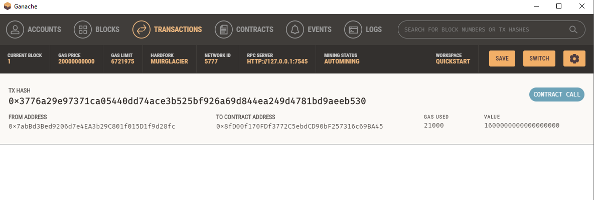

# FinTech Finder

### A web app that is used for choosing the appropriate candidate for the job, and sending them their payment through the blockchain.
---
As you can see, I chose the cheapest candidate, because I have no money, and no standards:

---
The resulting transaction is reflected using Ganache.  Here was my new balance:

Don't steal my seed phrase!  Actually, I don't care, you can have it.

---
My transaction is reflected on the block:

---
And if we look at the recipient's address, we can see they received the ether:

